# Financial UI Personas

## Overview

Ten distinct visual personas for financial UIs. The base skill `financial-ui-patterns` handles correctness (tabular nums, semantic tokens, tick flash, accessibility). This skill handles **aesthetic personality** — the brand-flavored layer on top.

**Layering:**
```
product-design                  → atomic decisions for any SaaS UI
financial-ui-patterns           → finance-specific correctness (mandatory)
financial-ui-personas (this)    → brand persona / visual polish (pick one)
```

You always apply the lower layers. You pick exactly one persona on top.

## When to Use

- User says "make it look like X" where X is a financial product or aesthetic
- User specifies brand/aesthetic direction ("Bloomberg style", "Robinhood feel", "FT-like", "API-dashboard aesthetic")
- Starting a new financial UI from scratch and picking the visual direction
- Refactoring an existing financial UI toward a specific aesthetic

**Don't use for:** marketing pages, blog posts, anything not loading data. Personas are calibrated for data-dense UIs.

## How to Pick

```dot
digraph pick_persona {
    "Who's using it?" [shape=diamond];
    "Pro trader / institutional?" [shape=diamond];
    "Editorial / news / analysis?" [shape=diamond];
    "API / developer / admin?" [shape=diamond];
    "Retail / consumer?" [shape=diamond];
    "Crypto-first?" [shape=diamond];
    "Native iOS companion?" [shape=diamond];

    "modern-pro-dark" [shape=box];
    "pro-terminal" [shape=box];
    "tasty-pro" [shape=box];
    "editorial-financial" [shape=box];
    "api-dashboard" [shape=box];
    "retail-polish-dark" [shape=box];
    "retail-polish-light" [shape=box];
    "crypto-exchange" [shape=box];
    "defi-native" [shape=box];
    "apple-native" [shape=box];

    "Who's using it?" -> "Pro trader / institutional?" -> "pro-terminal" [label="institutional desktop"];
    "Pro trader / institutional?" -> "modern-pro-dark" [label="modern pro web"];
    "Pro trader / institutional?" -> "tasty-pro" [label="options-focused"];
    "Who's using it?" -> "Editorial / news / analysis?" -> "editorial-financial" [label="yes"];
    "Who's using it?" -> "API / developer / admin?" -> "api-dashboard" [label="yes"];
    "Who's using it?" -> "Crypto-first?" -> "crypto-exchange" [label="centralized"];
    "Crypto-first?" -> "defi-native" [label="DEX/onchain"];
    "Who's using it?" -> "Retail / consumer?" -> "retail-polish-dark" [label="dark"];
    "Retail / consumer?" -> "retail-polish-light" [label="light/mobile"];
    "Who's using it?" -> "Native iOS companion?" -> "apple-native" [label="yes"];
}
```



## Persona Index

| Persona | Reference shipping products | Reference file | Status |
|---|---|---|---|
| `modern-pro-dark` | TradingView, Kraken Pro, Hyperliquid | `references/modern-pro-dark.md` | ✅ Deep |
| `editorial-financial` | FT.com, Bloomberg.com, WSJ | `references/editorial-financial.md` | ✅ Deep |
| `api-dashboard` | Massive, Stripe, Vercel, Linear | `references/api-dashboard.md` | ✅ Deep |
| `retail-polish-dark` | Robinhood, Public | `references/retail-polish-dark.md` | ✅ Deep |
| `pro-terminal` | Bloomberg Terminal, IBKR TWS, ThinkOrSwim | `references/pro-terminal.md` | ⚠️ Stub |
| `tasty-pro` | TastyTrade | `references/tasty-pro.md` | ⚠️ Stub |
| `crypto-exchange` | Coinbase Advanced, Binance, Bybit | `references/crypto-exchange.md` | ⚠️ Stub |
| `retail-polish-light` | Wise, Revolut, Cash App | `references/retail-polish-light.md` | ⚠️ Stub |
| `defi-native` | Uniswap, Jupiter, Solana ecosystem | `references/defi-native.md` | ⚠️ Stub |
| `apple-native` | iOS Stocks, macOS Stocks widget | `references/apple-native.md` | ⚠️ Stub |

Stubs include enough detail (palette, typography, density, reference URLs, anti-patterns) for first-pass implementation. Deep files include full CSS variable token sets and complete example components. When working on a stub-only persona, load reference URLs to study before generating.

## Persona Summaries

### modern-pro-dark — TradingView, Kraken Pro, Hyperliquid
Dark slate background. Single blue or purple accent. Sans body + tabular nums + mono on tickers. 28-32px table rows, 24-28px order book. Hairline borders. 4-6px radius. No gradients, no shadows beyond elevation. The default for serious pro consumer products.

### pro-terminal — Bloomberg, IBKR TWS, ThinkOrSwim
Black or near-black with amber or cyan accent. Mono-everywhere, ALL CAPS section labels. 24-28px rows, max density. 0-2px radius. Hairline borders. Function-key shortcuts in tooltips. Institutional desktop aesthetic.

### tasty-pro — TastyTrade
Black background, pink-magenta accent, green/red signals. Sans + tabular. Options-focused: prominent strikes, Greeks readability. 32-36px rows. Distinctive enough to call out separately even though it shares Modern Pro fundamentals.

### crypto-exchange — Coinbase Advanced, Binance, Bybit
Dark slate or near-black. Yellow (Binance) or blue (Coinbase) accent. Higher cell-level color saturation than Modern Pro. Subtle gradients OK on chart areas. 28-32px rows. More aggressive use of colored cells in tables.

### retail-polish-dark — Robinhood, Public
Pure or near-pure black. Single signal color (often brand green). Very large display numbers (32-48px hero). Generous whitespace. 48-56px row heights. 12-20px radius (large, friendly). Gamification-appropriate. Mobile-first feel even on web.

### retail-polish-light — Wise, Revolut, Cash App
White or near-white background. Colorful brand palette. Sans body with friendly weight choices. Big whitespace. 40-48px rows. 16-20px radius. Mobile-style cards translated to web.

### editorial-financial — FT.com, Bloomberg.com, WSJ
Cream/beige (FT salmon-on-pinkish-beige) or off-white. Serif headlines, sans body, mono for data tables. Sharper radii (0-4px). 36-44px rows. Longer-form analysis blocks between data. Newspaper sensibility.

### api-dashboard — Massive, Stripe, Vercel, Linear
Near-black or near-white. Single brand accent. Heavy on mono for code/IDs/keys. Status pills used aggressively. 40-48px rows (more relaxed than trading). Generous form fields. Documentation-adjacent aesthetic. Copy buttons everywhere.

### defi-native — Uniswap, Jupiter, Solana ecosystem
Gradients permitted (radial backgrounds, glassy panels with backdrop-blur). Saturated brand palette (Uniswap pink, Solana purple/teal). Playful, less institutional. Often light or hybrid theme.

### apple-native — iOS Stocks, macOS Stocks widget
Translucent surfaces, SF Pro Display + SF Pro Mono. System blur (vibrancy). Seamless light/dark transitions. Refined iOS feel. Use only for native companions or web that explicitly mimics native iOS.

## Cross-Cutting Rules

These apply regardless of persona:

1. **Base correctness from `financial-ui-patterns` still applies.** Tabular nums, semantic tokens, tick flash, accessibility, decimal alignment. A persona overrides token *values* and *aesthetic choices*, not correctness rules.
2. **One persona per product.** Don't mix Modern Pro Dark and Editorial Financial in the same UI; the brain reads it as broken.
3. **Light theme matters.** Every persona must have a light variant. Pro Terminal's light variant uses light-amber-on-cream; Modern Pro Dark's light variant uses Supabase-slate. Define both.
4. **Density follows persona.** Pro Terminal is denser than Retail Polish Dark. Don't fight the persona's density rules to fit more data.
5. **Mono usage is persona-specific.** Pro Terminal uses mono everywhere. Retail Polish minimal. Modern Pro on tickers only. Editorial Financial on data tables only. Apple Native on Greeks/numbers only.

## When NOT to Use This Skill

- Marketing pages, landing pages, blog content
- Product UI with no financial data (CRMs, project tools, generic SaaS)
- One-off design tests where you want full freedom

## Common Mistakes

| Mistake | Why bad | Fix |
|---|---|---|
| Mixing two personas in one product | Reads as inconsistent / broken | One persona per product |
| Picking persona based on user's wishful brand mood | Personas describe shipping products; picking by mood often picks wrong | Pick based on user type and product category |
| Skipping the `financial-ui-patterns` base | Correctness fails (no tabular nums, wrong colors) | Always apply base layer first |
| Using DeFi Native or Crypto Exchange for traditional finance | Aesthetic mismatch users won't trust | Match audience expectation |
| Hard-coding persona token values inline | Brittle to theme switches | Use CSS variables; persona = token set |
| Defining persona only in dark mode | Pro users want light during the day | Ship both light + dark for every persona |

## Verification

Before declaring persona implementation done:

- [ ] One and only one persona is applied across the product
- [ ] Light + dark variants both render correctly
- [ ] Base `financial-ui-patterns` correctness still passes (tabular nums, semantic tokens, etc.)
- [ ] Mono usage matches persona's rules (everywhere / tickers only / data tables only / minimal)
- [ ] Density matches persona's row-height range
- [ ] Accent color and gradient/radius rules match persona
- [ ] If persona is a stub: have you loaded reference URLs and matched key characteristics?

## See Also

- `financial-ui-patterns` — REQUIRED base layer
- `product-design` — atomic decisions for any SaaS UI
- `frontend-design` plugin — generic UI generation that avoids generic AI aesthetics
